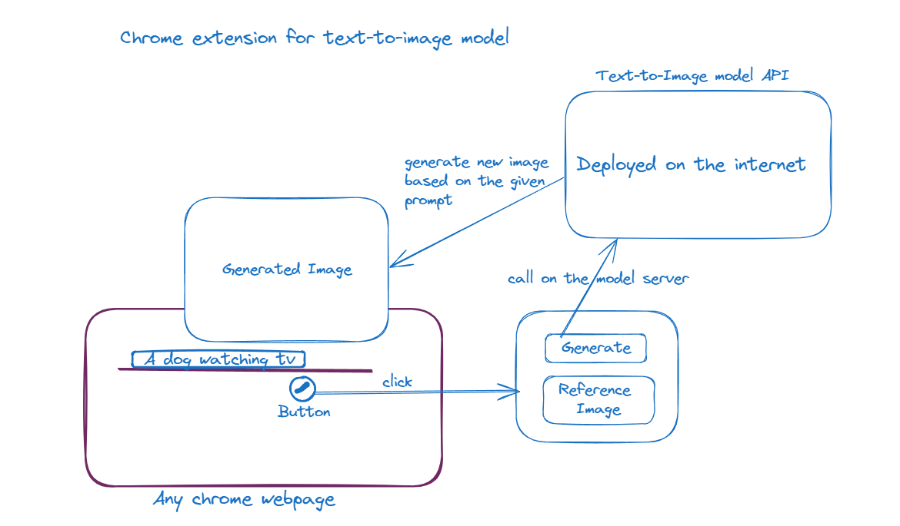

# Text-to-Image Converter
## Problem Statement
Imagining images from the texts can be hard

## Solution
A **chrome extension** which can help users while: 
- **Reading**: when reading but would not be able to imagine what is being written then a generated image can help users to imagine a picture of what has written.
- **Creating PPTs**: Suppose wanting to give an analogy out of creativity but too much text won’t look catchy to the users, hence generating an image based on the given analogy would be a great idea.

## Architecture 

## How to get started with the extension?
### copy and paste the link given below in your google colab notebook and run all the cells.
[Text-to-Image Model](https://colab.research.google.com/drive/1c5HfV2fZFTuelAQD53QHhkOPJbypK0ct?usp=sharing)
